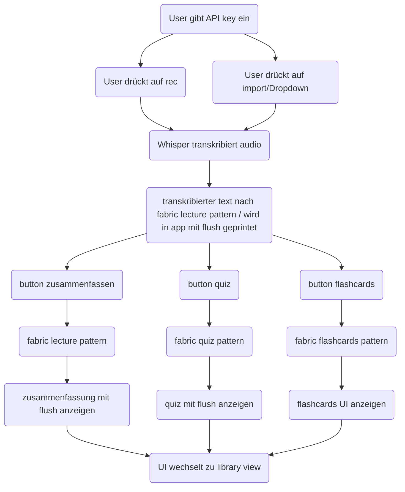

rec button
dragndrop feld für audio/vid
textfeld für zusammenfassung
feld für alle vorlesungen (ordner struktur):
- vorlesungen (ordner)
    - zusammenfassung
    - quiz
    - flashcards
    - transkript

button für flashcards und quiz
chatbot feld 
(json für memory von bot zusammenhang zur vorlesung)

datenstruktur zum speichern von vorlesungen
pattern für quiz und flashcard schreiben (immer nach einem schema)

lecture pattern umschreiben sodass mermaid charts

rec/dnd fenster drop down für ai aussuchen (fabric -L)

